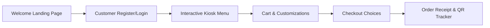
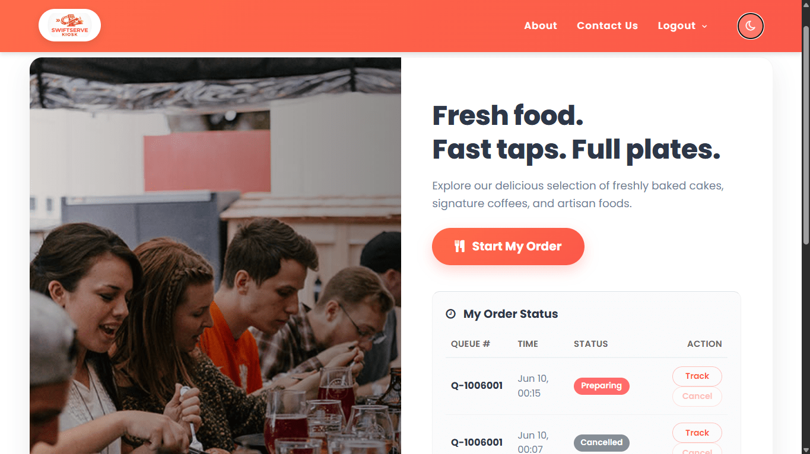
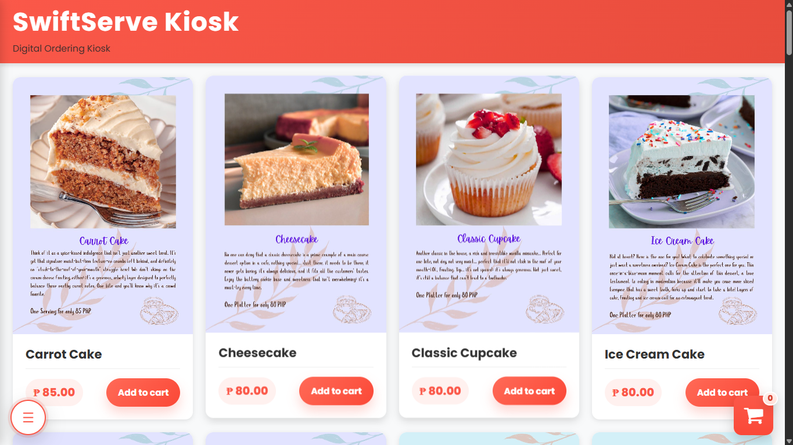
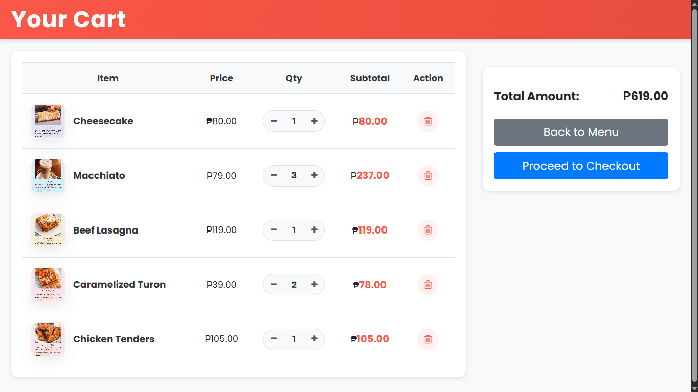
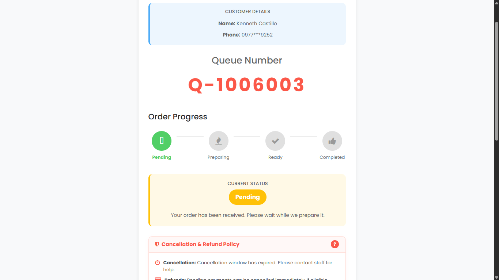
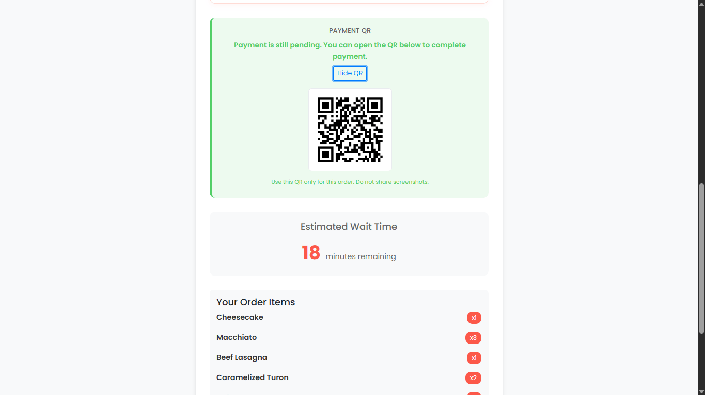

# SwiftServe Kiosk ☕ (https://swiftservekiosk.pythonanywhere.com/)
> **OCKS — Online Cafe Kiosk System**

SwiftServe Kiosk is an interactive, modern, and user-friendly online cafe self-service kiosk system designed to streamline the food and beverage ordering process. It aims to reduce physical queues, minimize wait times, and offer cafe owners/staff an intuitive, real-time administrative dashboard for order tracking and status management.

---

## 📖 Table of Contents
1. [Project Overview](#-project-overview)
2. [Tech Stack](#%EF%B8%8F-tech-stack)
3. [User Flow & Key Features](#-user-flow--key-features)
4. [Admin Access & Dashboard](#-admin-access--dashboard)
5. [Local Installation & Setup](#%EF%B8%8F-local-installation--setup)
6. [Deployment Details](#-deployment-details)
7. [Project Context](#%EF%B8%8F-project-context)

---

## 🌟 Project Overview

### Introduction
SwiftServe Kiosk solves the problem of long wait times and order miscommunications in busy cafe environments. For **customers**, it offers a self-service ordering menu with size options and order customization. For **staff and managers**, it replaces paper-based workflows with a real-time order tracking dashboard that updates statuses and generates thermal-style receipts.

---

## 🛠️ Tech Stack

### Frontend
- **Languages**: HTML5, Vanilla CSS3 (Custom styling, variable-based theme architecture, glassmorphism, responsive grid layouts), JavaScript (ES6+, dynamic AJAX-based cart actions).
- **Icons**: Font Awesome v4.7.0.
- **Responsive Framework**: Bootstrap v4.0.0 (minimal layouts).

### Backend & Database
- **Framework**: Django v5.2.12 (Python)
- **Database**: SQLite3 (relational schema mapping Customer, Order, OrderItem, ItemConfiguration, Category, MenuItem, and Payment).
- **Libraries**:
  - `Pillow` (Image uploading and menu item processing)
  - `qrcode` (On-the-fly QR code generation for order tracking and cashier payment processing)
  - `django-widget-tweaks` (Form rendering utility)

---

## 🔄 User Flow & Key Features

### Basic Customer Flow


1. **Get Started / Welcome Page** (`/get-started/`): Customers are welcomed with a dynamic sliding food and drink gallery.
2. **Customer Registration & Secure Login** (`/customer/register/` & `/customer/login/`):
   - Mandatory field validation (Name, Phone, Password, and **Required Email**).
   - Cookies support "Remember Me" for automated phone/email auto-fill.
3. **Interactive Menu** (`/kiosk/menu/`): Allows users to browse categories (Drinks, Snacks, Specialties) and choose item sizes (Dwarf, Classic, Giant, etc.).
4. **Kiosk Cart** (`/kiosk/cart/`): Review items, quantities, and individual subtotals.
5. **Checkout & Order Options** (`/kiosk/checkout/`):
   - Choose order type: **Take Out**, **Dine In** (with party size checks), or **Delivery**.
   - Choose payment method (Cash, GCash, or Card).
6. **Order Receipt & QR Code** (`/kiosk/order/create/`): Outputs a printable receipt with wait times and a dynamic QR code for order verification and payments.
7. **Real-time Order Status Tracker** (`/kiosk/order/[id]/status/`): Shows order steps (Pending -> Preparing -> Ready -> Completed).
   - Customers can request order cancellation within a 90-second safety window.

### Screenshots

#### 1. Customer Home / Get Started Page
The landing screen for logged-in customers features a welcome greeting card, a dynamic category menu carousel, and a list of their recent orders with cancellation status badges.


#### 2. Kiosk Ordering Menu
The main interface where users can select categories, customize product options, choose sizes (Dwarf, Classic, Giant, etc.), and manage their cart.


#### 3. Checkout Page
The ordering step where customers verify their items, choose an order type (Take Out, Dine In, or Delivery), and select their payment method.


#### 4. Order Status Tracker & Receipt
The post-order tracking screens. Customers can view their receipt, check the dynamic QR code for verification, track progress in real-time, or request order cancellation within the allowed time limit.



---

## 👤 Admin Access & Dashboard

### How to Access
1. Start the Django local server.
2. Navigate to `/admin/orders/` in your browser.
3. Sign in using administrative staff credentials One is provided for viewing and testing purposes: Username: 'tester'; Password: 'tester'. (Without the '')
4. (Optional) To access database raw tables directly, go to `/admin/` to view Django's built-in models admin.

### Live Admin Capabilities
- **Status Cards Counters**: Live metrics representing the volume of orders currently *Pending*, *Preparing*, *Ready*, and *Completed* (fully aligned vertically).
- **Interactive Search & Filtering**: Filter list items instantly by order status (including *Cancelled*), payment status, and order type, or search by queue numbers and product names.
- **Real-Time Status & Payment Updates**: Seamlessly change an order status or payment status directly from the table rows with visual change indicator highlights.
- **Direct Navigation to Customers**: Admin dashboard header contains a single-click direct link to view registered customer accounts details.
- **Isolated Thermal Printing**: Single-order print preview that extracts receipt details to print a clean thermal ticket omitting the administrative controls.

---

## ⚙️ Local Installation & Setup

Follow these steps to run the project locally on your machine:

### Prerequisites
- Python 3.10+
- Pip (Python Package Installer)

### Installation Steps

1. **Clone/Unpack the Repository**:
   ```bash
   git clone <repository-url>
   cd online_cafe_kiosk_sytem_CSE
   ```

2. **Set Up Python Virtual Environment**:
   ```bash
   # Create environment
   python -m venv ocksvenv
   
   # Activate on Windows (CMD/PowerShell)
   ocksvenv\Scripts\activate
   
   # Activate on macOS/Linux
   source ocksvenv/bin/activate
   ```

3. **Install Dependencies**:
   ```bash
   pip install -r requirements.txt
   ```

4. **Run Database Migrations**:
   ```bash
   cd OCKS
   python manage.py migrate
   ```

5. **Load Static & Media Assets**:
   ```bash
   python manage.py collectstatic --noinput
   ```

6. **Create Admin/Superuser Credentials**:
   ```bash
   python manage.py createsuperuser
   ```

7. **Run Unit Tests**:
   Verify everything is fully functional:
   ```bash
   python manage.py test
   ```

8. **Start local Development Server**:
   ```bash
   python manage.py runserver
   ```
   Open your browser and navigate to `http://127.0.0.1:8000/` to test the system.

---

## 🚀 Deployment Details
- **Hosting Platform**: [PythonAnywhere](https://www.pythonanywhere.com/)
- **Administrative/Support Email**: [swfitservekiosk@gmail.com](mailto:swfitservekiosk@gmail.com)

---

## Video Demonstration  
- [SwiftServe Kiosk - Video Demonstration](https://drive.google.com/file/d/1nc7r9xAKGjos6ownqkLjMAu1T8q8EzNd/view?usp=drive_link)

---

## 🗓️ Project Context

### Roadmap
- [x] Align admin row height metrics and dark theme color overrides.
- [x] Standardize order queue numbers dynamically (`Q-DDMMNNN`).
- [x] Enable strict verification for customer order details status page.
- [x] Require emails for user registration and add comprehensive test suite.
- [ ] Add SMS notification API integration to message users when order is "Ready".
- [ ] Integrate sales reports dashboard page with analytics.

### Contributors
* Castillo, Kenneth Vincent
* Malate, Juan Miguel
* Padrones, Kim Andrei

### License
This repository contains a **Private Academic Project** built for computer science coursework. Distribution, copying, or public reproduction is strictly prohibited without the consent of the contributors.
